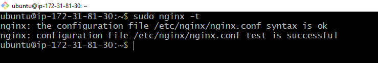

# STEP 1- Installing the NGIX Web Server

### The command below will be used to update the server's package index:

`sudo apt update`

### The following command will get the NGIX intsalled

`sudo apt install nginx`

### This code verifies NGIX was succesfully installed and is running as a service in my server

`sudo systemctl status nginx`

### Opened TCP port 80 in the EC2 Instance which is the default port that web browsers use to access web pages on the Internet

### This is the output to check if we can access the NGIX locally

### Test that NGIX server is running over the browser

# STEP 2-Installing MySQL

### The following command installs MySQL in the server

`sudo apt install mysql-server`

### The following command runs a security script that removes some insecure default settings and lock down access to the database system

### This code verifies that we can log in to the MySQL server

`sudo mysql`

# Step 3- Installing PHP

### The command below installs *php-fpm* and *php-mysql*

`sudo apt install php-fpm php-mysql`

**The *php components* have been installed.**

# STEP 4- Configuring NGIX to use Php Procesessor

### The following command will create the root web directory **your_domain** 

`sudo mkdir /var/www/projectLEMP`

### This next command will assign ownership of the directory with the $USER environment variable, which will reference the current system user 

`sudo chown -R $USER:$USER /var/www/projectLEMP`

### A new configuration file in the NGIX sites-available will be opened using the command below

`sudo nano /etc/nginx/sites-available/projectLEMP`

 ### The following bare-bones configuration will be added into the newly created file and then saved using > cntrl x y followed by >Enter.

### The following command will activate the configuration by linking the config file from NGIX's site-enabled directory

`sudo ln -s /etc/nginx/sites-available/projectLEMP /etc/nginx/sites-enabled/`

### Test for any errors using the code below

`sudo nginx -t`

### Disabled default NGIX host  currently configured to listen on port 80

`sudo unlink /etc/nginx/sites-enabled/default`

### Reloaded NGIX to apply the changes

`sudo systemctl reload nginx`

### Created  an index.html file in web root /var/www/projectLEMP location to test the new server block works as expected using:

`sudo echo 'Hello LEMP from hostname' $(curl -s http://169.254.169.254/latest/meta-data/public-hostname) 'with public IP' $(curl -s http://169.254.169.254/latest/meta-data/public-ipv4) > /var/www/projectLEMP/index.html`

### See screenshot of the above commands ran

### Using my public IP address in a web browser, the screenshot below shos the NGIX server is working properly

# STEP 5- Testing PHP with NGIX

### LAMP stack is completely installed and fully operational at this point. Tested it to validate that Nginx can correctly hand .php files off to the PHP processor by opening a new file (info.php) within the document root

`sudo nano /var/www/projectLEMP/info.php`

### This valid PHP code will return iformation about the server

`<?php`    

 `phpinfo();`

### Using my Public IP address followed by /info.php, the output shows PHP is working with NGIX as expected.

# STEP 6- Retrieving data from My SQL database with PHP

### Connected to the MySQL console using the root account. Then a new database named " example_database was created

`sudo mysql`

`CREATE DATABASE `example_database`;`

###  A new user named "example_user" was created for the newly created database with password defined as "password". mysql_native_password is the default authentication method.

` CREATE USER 'example_user'@'%' IDENTIFIED WITH mysql_native_password BY 'password';`

###  Permission is then given to the new user over the newly created database. This permission gives full priviledges over the database while preventing the user from creating or modifying other databses on the server.

` GRANT ALL ON example_database.* TO 'example_user'@'%';`

This command was used to exit the MySQL shell

`mysql> exit`

The screenshot of the above commands ran:

###  Test to see if the new user has proper permissions by logging into the MySQL console again using the  correct user credentials.

`mysql -u example_user -p`

###  Access to the "example_database" database was confirmed using the following command:

` SHOW DATABASES;`

###  A test table named "todo_list" was created by running  the following command.

`CREATE TABLE example_database.todo_list (item_id INT AUTO_INCREMENT, content VARCHAR(255),PRIMARY KEY(item_id)); ,`

###  The following command was instered into the table created above a few times using different values ("My second important item", "my third important item", and "and this one more thing")

`INSERT INTO example_database.todo_list (content) VALUES ("My first important item");`

### The command below was used to confirm the data was saved successfully

`SELECT * FROM example_database.todo_list;`

### The follwoing command was ran in the todo-list php script to connect the PHP script to the MySQL database. It aslo queries the content of the "todo_list and displays the results in a list. Then the file was saved and closed 

`<?php

$user = "example_user";

$password = "password";

$database = "example_database";

$table = "todo_list";`

`try {`

`$db = new PDO("mysql:host=localhost;dbname=$database", $user, $password);`

`echo "<h2>TODO</h2><ol>";`

`foreach($db->query("SELECT content FROM $table") as $row) {`

`   echo "<li>" . $row['content'] . "</li>";
  }`
  
  `echo "</ol>";`

  `} catch (PDOException $e) {`

 `print "Error!: " . $e->getMessage() . " ";` 

`die();`

`}

### Using my Public IP address followed by /todo_list.php, the output shows data can be retrived from MySQL database using PHP correctly.

